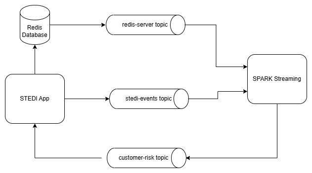
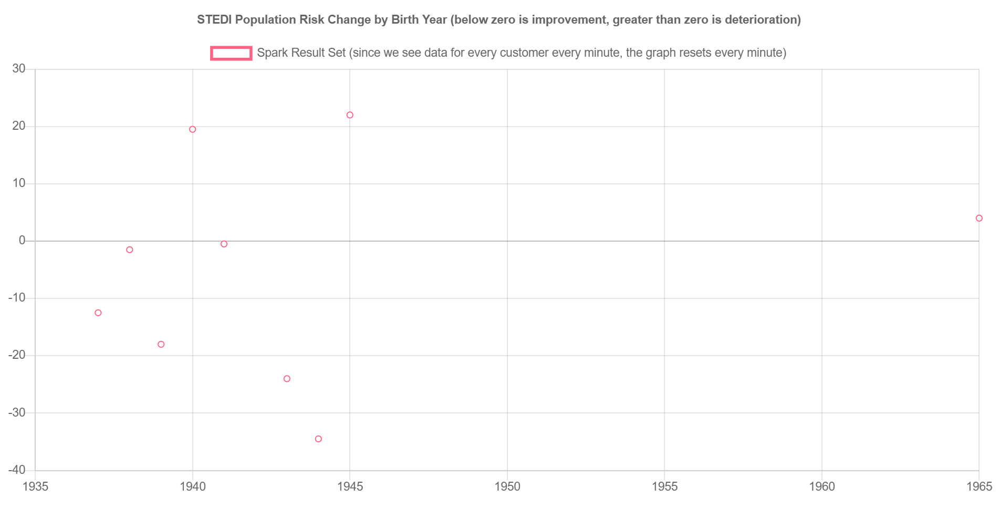
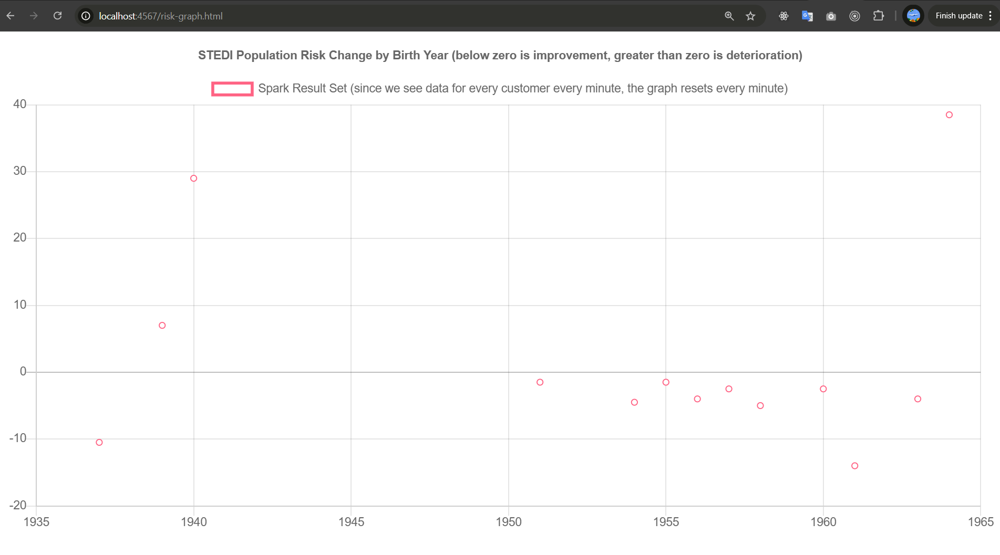

# Evaluate Human Balance with Spark Streaming
## STEDI Ecosystem

You work for the data science team at STEDI, a small startup focused on assessing balance for seniors. STEDI has an application that collects data from seniors during a small exercise. The user logs in, and then selects the customer they are working with. Then the user starts a timer, and clicks a button with each step the senior takes. When the senior has reached 30 steps, their test is finished. The data transmitted enables the application to monitor seniors’ balance risk. 

## STEDI STREAMING DIAGRAM


* The STEDI data science team has configured some real-time data sources using Kafka Connect. One of those data sources is Redis. When a customer is first assessed in the STEDI application, their record  is added to a sorted set called Customer in redis. Redis is running in a docker container on the default redis port (6379). Redis is configured as a Kafka source, and whenever any data is saved to Redis (including Customer information), a payload is published to the Kafka topic called redis-server.
----
* The application development team has programmed certain business events to be published automatically to Kafka. Whenever a customer takes an assessment, their risk score is generated, as long as they have four or more completed assessments. The risk score is transmitted to a Kafka topic called `stedi-events`. The `stedi-events` Kafka topic has a String key and a String value as a JSON object with this format:

    ```json
    {"customer":"Jason.Mitra@test.com",
    "score":7.0,
    "riskDate":"2020-09-14T07:54:06.417Z"
    }
    ```
* The application development team was not able to complete the feature as the graph is currently not receiving any data. Because the graph is currently not receiving any data, you need to generate a new payload in a Kafka topic and make it available to the STEDI application to consume. The new Kafka topic to transmit the complete risk score with birth date, so the data can be viewed in the STEDI application graph.
    ```json
    {"customer":"Santosh.Fibonnaci@test.com",
    "score":"28.5",
    "email":"Santosh.Fibonnaci@test.com",
    "birthYear":"1963"
    } 
    ```
* Once the data is populated in the configured kafka topic, the graph should have real-time data points




----
# PROJECT RUBRIC

## Initialize Spark Components
1. Start a Spark cluster. The log contains a statement “Successfully registered with master spark”
- [spark-master.log](spark/logs/spark-master.log)
- [spark-worker.log](spark/logs/spark-worker.log)

2. The Spark application successfully executes on the Spark cluster
