# Public Transit Status with Apache Kafka

In this project, we will construct a streaming event pipeline around Apache Kafka and its ecosystem. Using public data from the [Chicago Transit Authority](https://www.transitchicago.com/data/) we will construct an event pipeline around Kafka that allows us to simulate and display the status of train lines in real time.

## Description

The Chicago Transit Authority (CTA) has asked us to develop a dashboard displaying system status for its commuters. We have decided to use Kafka and ecosystem tools like REST Proxy and Kafka Connect to accomplish this task.

Our architecture will look like so:


## 1. Create Kafka Producer
The first step in our plan is to configure the train stations to emit some of the events that we need. The CTA has placed a sensor on each side of every train station that can be programmed to take an action whenever a train arrives at the station.

1. Complete the code in [producers/models/producer.py](producers/models/producer.py)

2. Define a `value` schema for the arrival event in [producers/models/schemas/arrival_value.json](producers/models/schemas/arrival_value.json)
	* `station_id`
	* `train_id`
	* `direction`
	* `line`
	* `train_status`
	* `prev_station_id`
	* `prev_direction`
3. Complete the code in [producers/models/station.py](producers/models/station.py)
	* A topic is created for each station in Kafka to track the arrival events
	* The station emits an `arrival` event to Kafka whenever the `Station.run()` function is called.
	* Ensure that events emitted to kafka are paired with the Avro `key` and `value` schemas
4. Define a `value` schema for the turnstile event in [producers/models/schemas/turnstile_value.json](producers/models/schemas/turnstile_value.json) with the following attributes
	* `station_id`
	* `station_name`
	* `line`
5. Complete the code in [producers/models/turnstile.py](producers/models/turnstile.py)
	* A topic is created for each turnstile for each station in Kafka to track the turnstile events
	* The station emits a `turnstile` event to Kafka whenever the `Turnstile.run()` function is called.
	* Ensure that events emitted to kafka are paired with the Avro `key` and `value` schemas

----
### 2. Configure Kafka REST Proxy Producer
The CTA have asked that we also send weather readings into Kafka from their weather hardware. Unfortunately, this hardware is old and we cannot use the Python Client Library due to hardware restrictions. Instead, we are going to use HTTP REST to send the data to Kafka from the hardware using Kafka's REST Proxy.

1. Define a `value` schema for the weather event in [producers/models/schemas/weather_value.json](producers/models/schemas/weather_value.json) with the following attributes
	* `temperature`
	* `status`
2. Complete the code in [producers/models/weather.py](producers/models/weather.py) so that:
	* A topic is created for weather events
	* The weather model emits `weather` event to Kafka REST Proxy whenever the `Weather.run()` function is called.
	* Ensure that events emitted to REST Proxy are paired with the Avro `key` and `value` schemas
----
### 3. Configure Kafka Connect
Finally, we need to extract station information from our PostgreSQL database into Kafka. We've decided to use the [Kafka JDBC Source Connector](https://docs.confluent.io/current/connect/kafka-connect-jdbc/source-connector/index.html).
1. Complete the code and configuration in [producers/connector.py](producers/connector.py)
	* `Use docker container name to connnect from kafka-connector container so that the connection.url should be should be "jdbc:postgresql://postgres:5433/cta" instead of "jdbc:postgresql://localhost:5433/cta"`
	* You can run this file directly to test your connector, rather than running the entire simulation.
	* Make sure to use the [Landoop Kafka Connect UI](http://localhost:8084) and [Landoop Kafka Topics UI](http://localhost:8085) to check the status and output of the Connector.
	* To delete a misconfigured connector: `CURL -X DELETE localhost:8083/connectors/stations`

----
### 4. Configure the Faust Stream Processor
We will leverage Faust Stream Processing to transform the raw Stations table that we ingested from Kafka Connect. The raw format from the database has more data than we need, and the line color information is not conveniently configured. To remediate this, we're going to ingest data from our Kafka Connect topic, and transform the data.

1. Complete the code and configuration in [consumers/faust_stream.py](consumers/faust_stream.py)

2. We must run this Faust processing application with the following command:
```
faust -A faust_stream worker -l info
```

----
### 5. Configure the KSQL Table
Next, we will use KSQL to aggregate turnstile data for each of our stations. Recall that when we produced turnstile data, we simply emitted an event, not a count. What would make this data more useful would be to summarize it by station so that downstream applications always have an up-to-date count

1. Complete the queries in [consumers/ksql.py](consumers/ksql.py)
	* `ksql` could be use in container `EXEC`. 
	* Made a mistake in table creation? `DROP TABLE <your_table>`. If the CLI asks you to terminate a running query, you can `TERMINATE <query_name>`

----
### 6. Create Kafka Consumers
With all of the data in Kafka, the final task is to consume the data in the web server that is going to serve the transit status pages to our commuters.

1. Complete the code in [consumers/consumer.py](consumers/consumer.py)
2. Complete the code in [consumers/models/line.py](consumers/models/line.py)
3. Complete the code in [consumers/models/weather.py](consumers/models/weather.py)
4. Complete the code in [consumers/models/station.py](consumers/models/station.py)


## Directory Layout
The project consists of two main directories, `producers` and `consumers`.
The following directory layout indicates the files that for modifying by adding a `*` indicator.

```
* - Indicates that the student must complete the code in this file

├── consumers
│   ├── consumer.py *
│   ├── faust_stream.py *
│   ├── ksql.py *
│   ├── models
│   │   ├── lines.py
│   │   ├── line.py *
│   │   ├── station.py *
│   │   └── weather.py *
│   ├── requirements.txt
│   ├── server.py
│   ├── topic_check.py
│   └── templates
│       └── status.html
└── producers
    ├── connector.py *
    ├── models
    │   ├── line.py
    │   ├── producer.py *
    │   ├── schemas
    │   │   ├── arrival_key.json
    │   │   ├── arrival_value.json *
    │   │   ├── turnstile_key.json
    │   │   ├── turnstile_value.json *
    │   │   ├── weather_key.json
    │   │   └── weather_value.json *
    │   ├── station.py *
    │   ├── train.py
    │   ├── turnstile.py *
    │   ├── turnstile_hardware.py
    │   └── weather.py *
    ├── requirements.txt
    └── simulation.py
```

## Running and Testing
This project could be completed in locally or udacity workspace. This submission I have completed by locallly with following are required to complete this project:
* WLS2 - Ubuntu 18.0.4
* Docker
* Python 3.7

To run the simulation, we must first start up the Kafka ecosystem on their machine utilizing Docker Compose.

```
docker-compose up -d
```

To completely retart environment

```
docker-compose down -v
```

Once docker-compose is ready, the following services will be available:

| Service | Host URL | Docker URL | Username | Password |
| --- | --- | --- | --- | --- |
| Public Transit Status | [http://localhost:8888](http://localhost:8888) | n/a | ||
| Landoop Kafka Connect UI | [http://localhost:8084](http://localhost:8084) | http://connect-ui:8084 |
| Landoop Kafka Topics UI | [http://localhost:8085](http://localhost:8085) | http://topics-ui:8085 |
| Landoop Schema Registry UI | [http://localhost:8086](http://localhost:8086) | http://schema-registry-ui:8086 |
| Kafka | PLAINTEXT://localhost:9092,PLAINTEXT://localhost:9093,PLAINTEXT://localhost:9094 | PLAINTEXT://kafka0:9092,PLAINTEXT://kafka1:9093,PLAINTEXT://kafka2:9094 |
| REST Proxy | [http://localhost:8082](http://localhost:8082/) | http://rest-proxy:8082/ |
| Schema Registry | [http://localhost:8081](http://localhost:8081/ ) | http://schema-registry:8081/ |
| Kafka Connect | [http://localhost:8083](http://localhost:8083) | http://kafka-connect:8083 |
| KSQL | [http://localhost:8088](http://localhost:8088) | http://ksql:8088 |
| PostgreSQL | `jdbc:postgresql://localhost:5432/cta` | `jdbc:postgresql://postgres:5432/cta` | `cta_admin` | `chicago` |

Note that to access these services from your own machine, you will always use the `Host URL` column.

When configuring services that run within Docker Compose, like **Kafka Connect you must use the Docker URL**. When you configure the JDBC Source Kafka Connector, for example, you will want to use the value from the `Docker URL` column.

### Running the Simulation

There are two pieces to the simulation, the `producer` and `consumer`. As you develop each piece of the code, it is recommended that you only run one piece of the project at a time.

However, when you are ready to verify the end-to-end system prior to submission, it is critical that you open a terminal window for each piece and run them at the same time. **If you do not run both the producer and consumer at the same time you will not be able to successfully complete the project**.

#### To run the `producer`:

1. `cd producers`
2. `virtualenv venv`
3. `. venv/bin/activate`
4. `pip install -r requirements.txt`
5. `python simulation.py`

Once the simulation is running, you may hit `Ctrl+C` at any time to exit.

#### To run the Faust Stream Processing Application:
1. `cd consumers`
2. `virtualenv venv`
3. `. venv/bin/activate`
4. `pip install -r requirements.txt`
5. `faust -A faust_stream worker -l info`


#### To run the KSQL Creation Script:
1. `cd consumers`
2. `virtualenv venv`
3. `. venv/bin/activate`
4. `pip install -r requirements.txt`
5. `python ksql.py`

#### To run the `consumer`:

** NOTE **: Do not run the consumer until you have reached Step 6!
1. `cd consumers`
2. `virtualenv venv`
3. `. venv/bin/activate`
4. `pip install -r requirements.txt`
5. `python server.py`

# PROJECT RUBRIC
### Kafka Producer
1. Kafka topics are created with appropriate settings
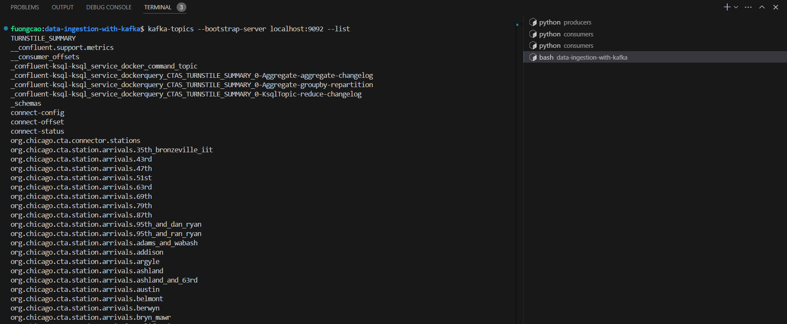
2. Kafka messages are produced successfully
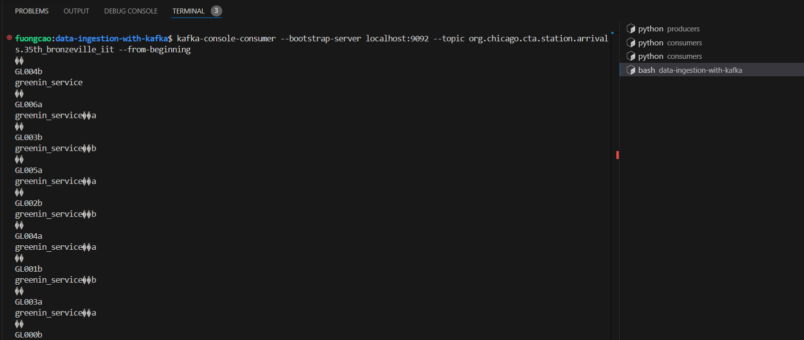
3. All messages have an associated value schema
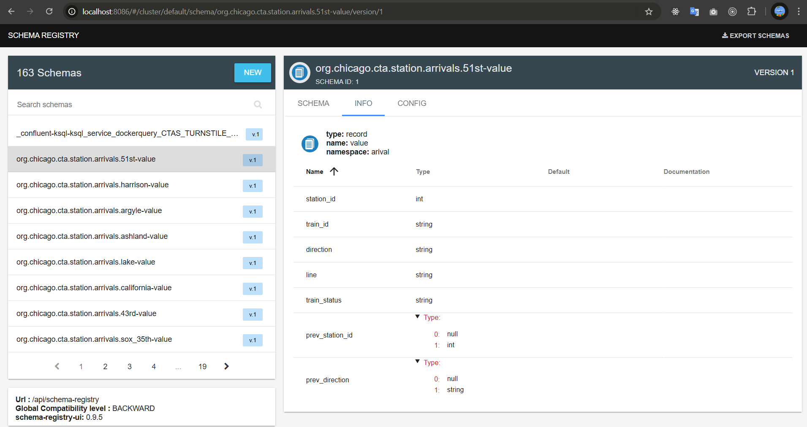
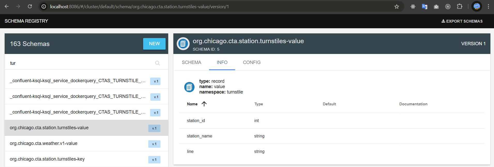

----
### Kafka Consumer
1. Messages are consumed from Kafka
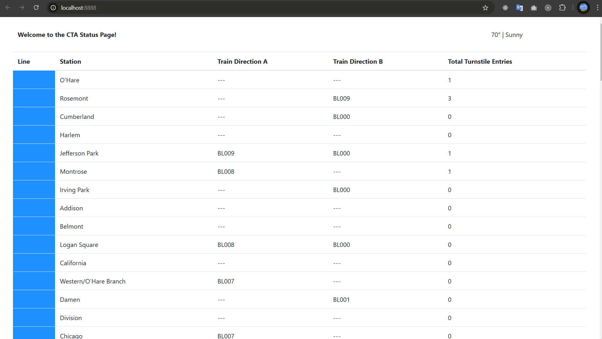
2. Stations data is consumed from the beginning of the topic
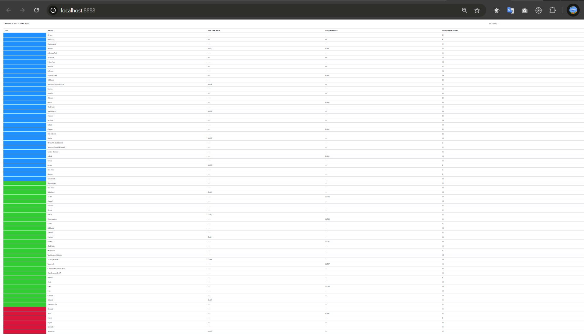

----
### Kafka REST Proxy
1. Kafka REST Proxy successfully delivers messages to the Kafka Topic
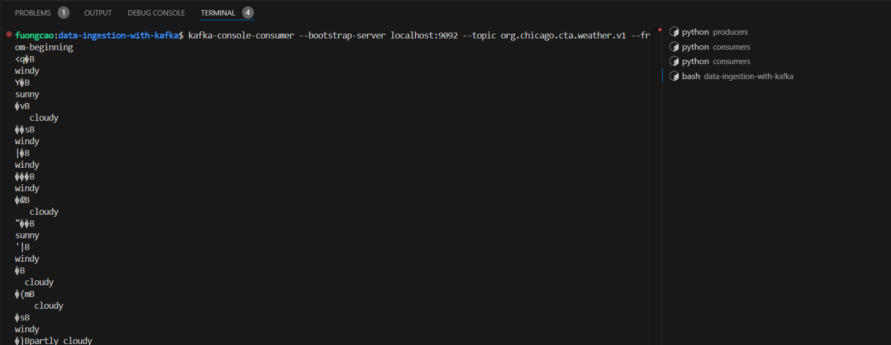
2. Messages produced to the Kafka REST Proxy include a value schema
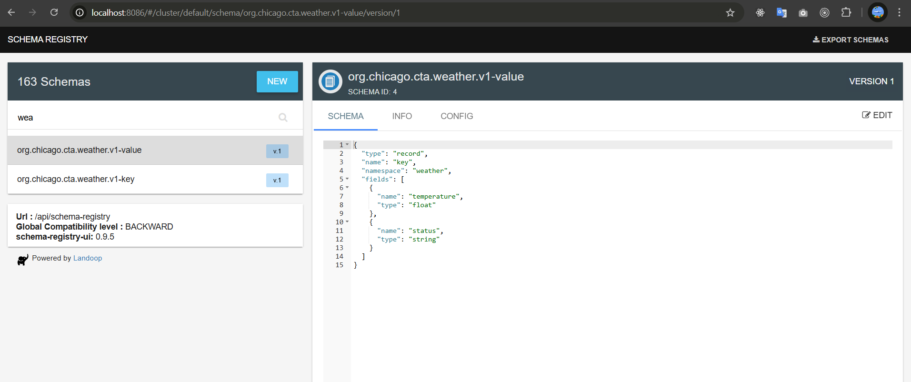

----
### Kafka Connect
1. Kafka Connect successfully loads Station data from Postgres to Kafka
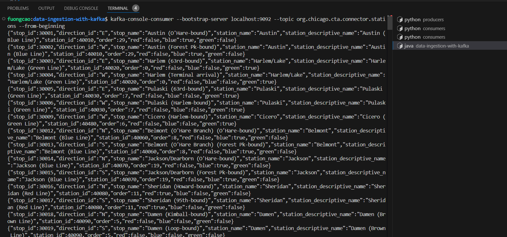
2. Kafka Connect is configured to define a Schema
3. Kafka Connect is configured to load on an incrementing ID
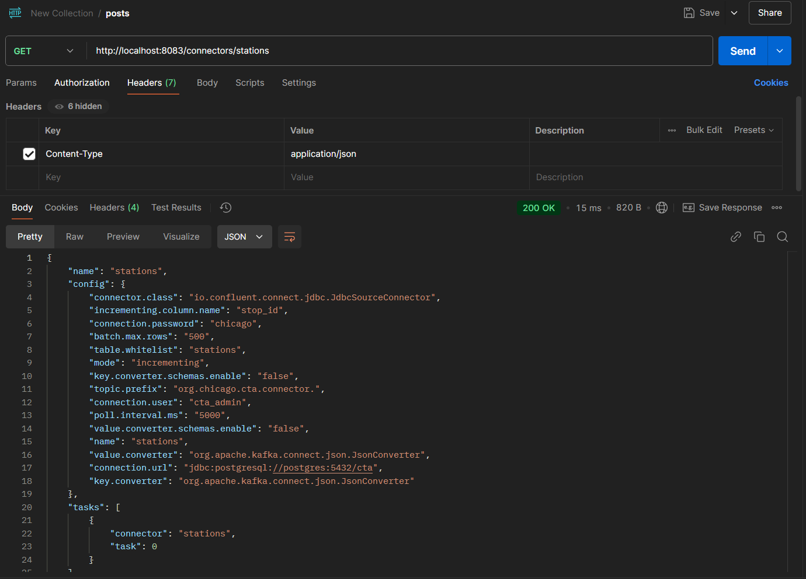

### Faust Streams
1. The Faust application ingests data from the stations topic
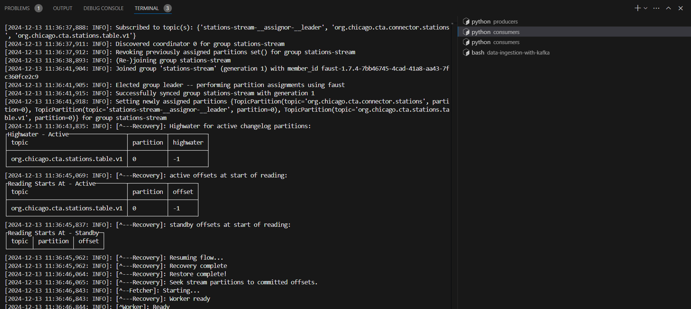
2. Data is translated correctly from the Kafka Connect format to the Faust table format
3. Transformed Station Data is Present for each Station ID in the Kafka Topic
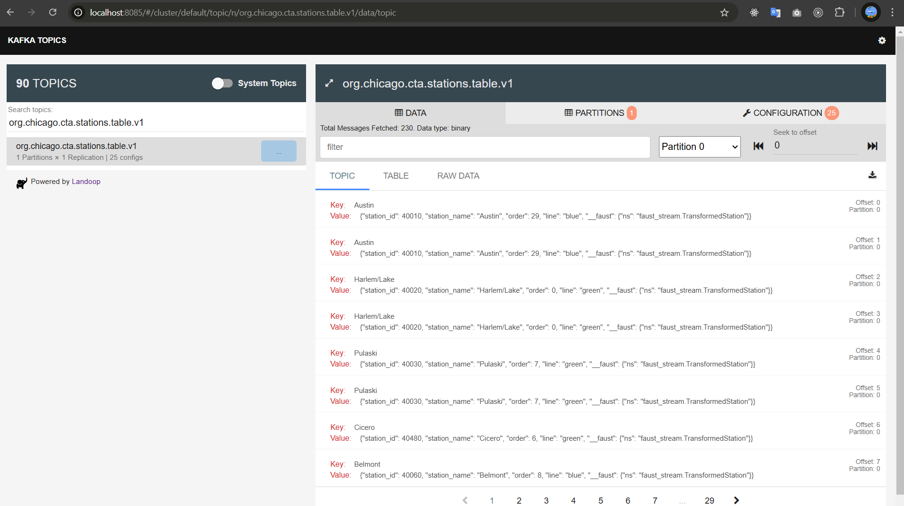

----
###  KSQL
1. Turnstile topic is translated into a KSQL Table
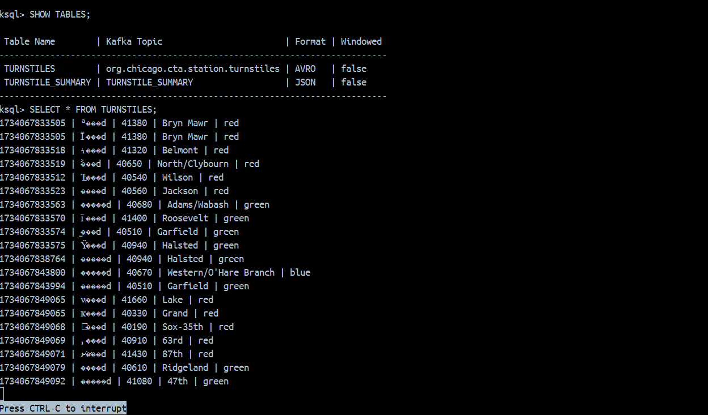
2. Turnstile table is aggregated into a summary table
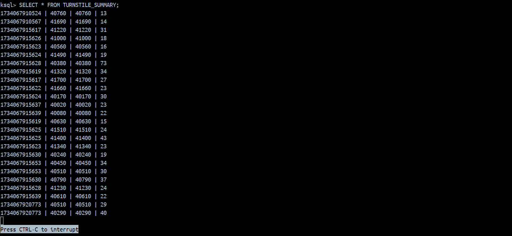